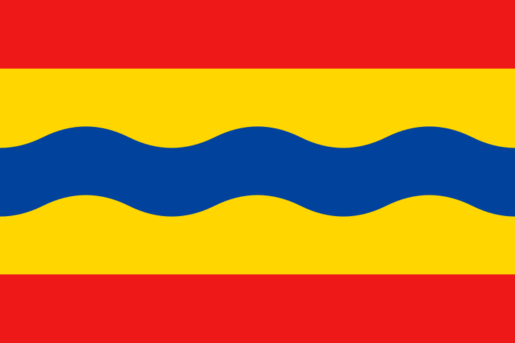

# Ramon Smit

Engineer, developer, tinkerer, self-hoster.

 Netherlands &nbsp;·&nbsp;  Overijssel &nbsp;·&nbsp;  Kampen

---

### 🎵 Now Playing

---

### 💻 Tech

---

### 🛠 Things I build

- Self-hosted infrastructure — Jellyfin, Home Assistant, and whatever else needs a server
- Small utilities that scratch my own itch
- Web tools that do one thing well

---

### 📡 Find me

- 🌍 [music.ramonsmit.nl](https://music.ramonsmit.nl) — what I'm listening to
- 📍 [waaris.ramonsmit.nl](https://waaris.ramonsmit.nl) — where I am
